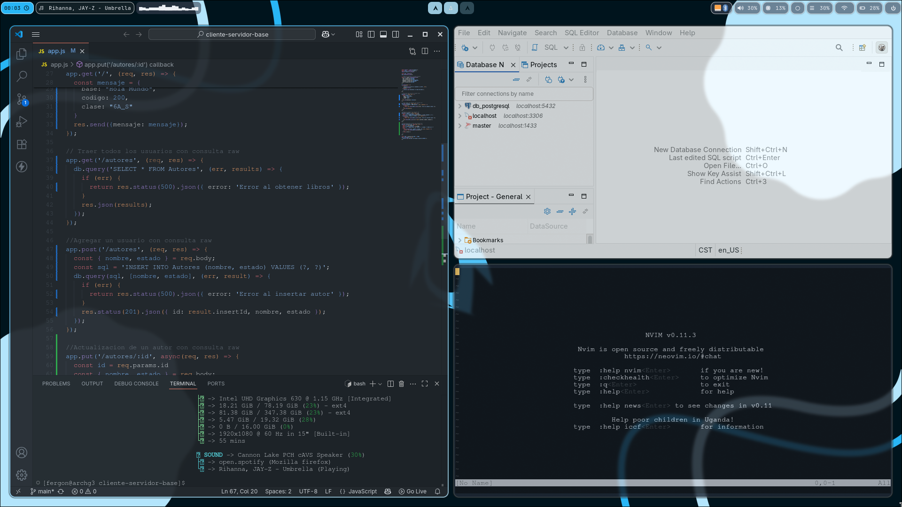

# 🚀 Arch Linux + Hyprland Dotfiles

My personal dotfiles configuration for a sleek and modern Arch Linux setup featuring Hyprland as the window manager.

## 📸 Screenshots

### Desktop Overview

### Workspace in Action

## 🏗️ System Information

- OS: Arch Linux
- WM: Hyprland (Wayland)
- Bar: Waybar
- Terminal: Kitty
- File Manager: Dolphin
- Browser: Firefox
- Launcher: Wofi
- Display Manager: Ly
- Screenshots: Hyprshot
- Wallpapers: Hyprpaper
- Color Picker: Hyprpicker
- Screen Lock : Hyprlock

## 📦 Applications & Tools

### Core System

- Hyprland - Dynamic tiling Wayland compositor
- Waybar - Highly customizable status bar
- Wofi - Application launcher and dmenu replacement
- Ly - Lightweight display manager
 
### Applications

- Kitty - GPU-accelerated terminal emulator
- Firefox - Web browser
- Dolphin - KDE file manager
- DBeaver - Database administration tool
- Visual Studio Code - Code editor

### Hyprland Ecosystem

- Hyprshot - Screenshot utility for Hyprland
- Hyprpaper - Wallpaper utility for Hyprland
- Hyprpicker - Color picker for Hyprland
- Hyprlock - Screen lock for Hyprland

## 🙏 Acknowledgments

- [Hyprland](https://hypr.land/) - Amazing Wayland compositor
- [Waybar](https://github.com/Alexays/Waybar) - Fantastic status bar
- The Arch Linux community for excellent documentation

### ⭐ Star this repository if you find it useful!